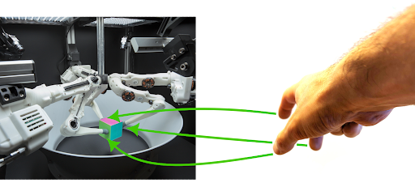

# Learning Three-Fingered Manipulation Through Low-Cost Teleoperation and Imitation Learning

[Rohan Walia]()1

1Technical University of Munich

## Codebase structure
The teleoperation implementation is given in the directory [open_teach](./open_teach) and the MuJoCo simulation environment used in [trifingermujocoenv](./trifingermujocoenv). Instructions how to setup  For the imitation learning algorithms, training and evaluation was done for Diffusion Policy (DP) and Consistency Policy (CP)

## Videos
